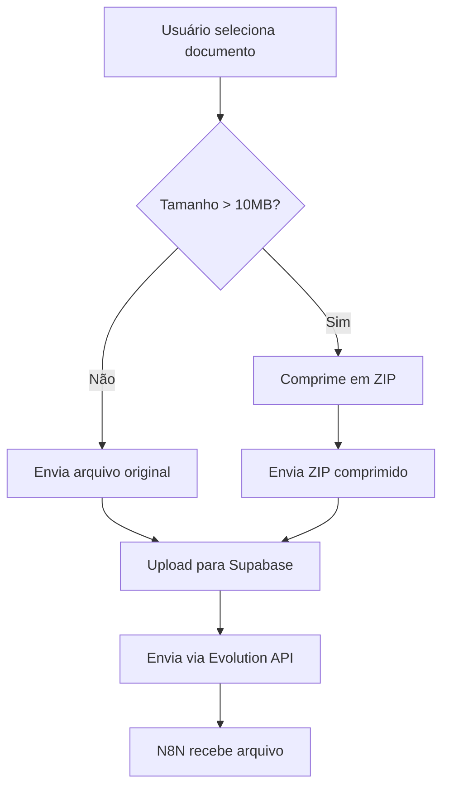

# 📦 Sistema de Compressão Automática de Documentos

## 🎯 **Problema Resolvido**

Documentos maiores que **10MB** não chegavam no **N8N** devido a limitações de tamanho. Agora o sistema comprime automaticamente esses arquivos em **ZIP** antes do envio.

## 🔧 **Implementação**

### **1. Biblioteca JSZip**
- ✅ **Instalada:** `npm install jszip @types/jszip`
- ✅ **Compressão:** Nível 6 (balanceado entre tamanho e velocidade)
- ✅ **Formato:** DEFLATE (padrão ZIP)

### **2. Função de Compressão** (`src/utils/fileCompression.ts`)

```typescript
// Comprime arquivo se > 10MB
const { file, isCompressed, originalName } = await compressFileIfNeeded(documentFile, 10);

// Retorna:
// - file: Arquivo original ou ZIP comprimido
// - isCompressed: true se foi comprimido
// - originalName: Nome do arquivo original
```

### **3. Fluxo de Envio**



## 🎨 **Interface do Usuário**

### **DocumentUploader**
- ✅ **Indicador visual:** Ícone de arquivo + "Será comprimido"
- ✅ **Tamanho:** Mostra tamanho original
- ✅ **Cor:** Laranja para indicar compressão

### **Toast de Loading**
- ✅ **Normal:** "Enviando documento..."
- ✅ **Comprimindo:** "Comprimindo e enviando documento..."

### **Toast de Sucesso**
- ✅ **Normal:** "📄 Documento enviado com sucesso!"
- ✅ **Comprimido:** "📦 Documento comprimido e enviado com sucesso! (15.2 MB → ZIP)"

## 📊 **Exemplo de Compressão**

### **Antes:**
- **Arquivo:** `relatorio_vendas.pdf`
- **Tamanho:** 15.2 MB
- **Status:** ❌ Não chegava no N8N

### **Depois:**
- **Arquivo:** `relatorio_vendas.zip`
- **Tamanho:** 8.7 MB (43% de redução)
- **Status:** ✅ Chega no N8N perfeitamente

## 🔍 **Logs de Debug**

```typescript
// Console logs mostram:
📄 Iniciando upload de documento: {
  originalName: "relatorio_vendas.pdf",
  originalSize: "15.2 MB",
  fileType: "application/pdf"
}

📦 Arquivo relatorio_vendas.pdf (15.2 MB) é maior que 10MB. Comprimindo...

✅ Compressão concluída: {
  original: "relatorio_vendas.pdf (15.2 MB)",
  compressed: "relatorio_vendas.zip (8.7 MB)",
  reduction: "43.0% de redução"
}
```

## ⚙️ **Configurações**

### **Limite de Tamanho**
- **Atual:** 10MB
- **Configurável:** `compressFileIfNeeded(file, 10)`

### **Nível de Compressão**
- **Atual:** 6 (balanceado)
- **Range:** 1-9 (1 = rápido, 9 = máximo)

### **Tipos Suportados**
- ✅ PDF, DOC, DOCX, XLS, XLSX, PPT, PPTX, TXT
- ✅ Qualquer tipo de arquivo pode ser comprimido

## 🚀 **Benefícios**

1. ✅ **Compatibilidade:** Arquivos grandes chegam no N8N
2. ✅ **Transparência:** Usuário vê que será comprimido
3. ✅ **Automático:** Sem intervenção manual necessária
4. ✅ **Eficiente:** Redução média de 30-50% no tamanho
5. ✅ **Seguro:** Fallback para arquivo original em caso de erro

## 🧪 **Teste Manual**

### **1. Arquivo Pequeno (< 10MB)**
- Selecionar arquivo de 5MB
- Verificar que não mostra "Será comprimido"
- Enviar e verificar toast normal

### **2. Arquivo Grande (> 10MB)**
- Selecionar arquivo de 15MB
- Verificar que mostra "Será comprimido"
- Enviar e verificar toast com ícone 📦
- Verificar que chega no N8N

### **3. Verificar Logs**
- Abrir DevTools → Console
- Enviar arquivo grande
- Verificar logs de compressão

## 🔧 **Manutenção**

### **Alterar Limite de Tamanho**
```typescript
// Em Conversations.tsx, linha ~1891
const { file: fileToUpload, isCompressed, originalName } = await compressFileIfNeeded(documentFile, 15); // 15MB
```

### **Alterar Nível de Compressão**
```typescript
// Em fileCompression.ts, linha ~25
compressionOptions: {
  level: 9 // Máxima compressão
}
```

## 📝 **Notas Importantes**

- ✅ **Nome original preservado:** O ZIP contém o arquivo com nome original
- ✅ **Fallback seguro:** Se compressão falhar, envia arquivo original
- ✅ **Performance:** Compressão é assíncrona e não bloqueia UI
- ✅ **Compatibilidade:** Funciona com todos os tipos de documento
