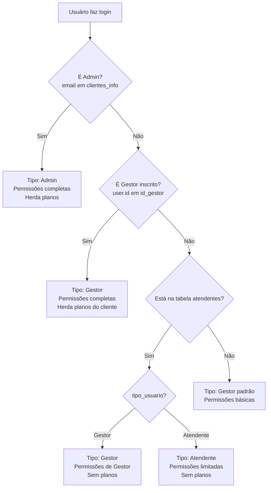

# Correção de Permissões para Gestores Inscritos

## 🚨 Problema Identificado

Usuários do tipo **Gestor** (inscritos via campo `id_gestor` na tabela `clientes_info`) não conseguiam ver as seguintes abas:
- ❌ **Configurações** (`/settings`)
- ❌ **Meus Chips** (`/meus-chips`)
- ❌ **Agentes de IA** (`/chatbots`)
- ❌ **Conexões** (`/conexoes`)

### Causa Raiz

O código dos hooks `useUserType.ts` e `usePermissions.ts` **não estava verificando** se o usuário era um **gestor inscrito** através do campo `id_gestor[]` na tabela `clientes_info`.

A lógica antiga só verificava:
1. Se o email estava na tabela `clientes_info` → Admin
2. Se estava na tabela `atendentes` → Gestor/Atendente

**Faltava**: Verificar se o `user.id` estava no array `id_gestor` do cliente.

---

## ✅ Correções Implementadas

### 1. **Atualização do `useUserType.ts`** (`src/hooks/useUserType.ts`)

Adicionada nova verificação após checagem de Admin:

```typescript
// ✅ NOVA LÓGICA: Verificar se é Gestor inscrito (id_gestor no cliente)
const { data: gestorData, error: gestorError } = await supabase
  .from('clientes_info')
  .select('*')
  .contains('id_gestor', [user.id])
  .eq('id', user.id_cliente)
  .maybeSingle();

if (gestorData && !gestorError) {
  console.log('useUserType: Usuário é Gestor inscrito via id_gestor');
  setUserType('Gestor');
  setUserInfo({
    tipo_usuario: 'Gestor',
    // Gestores inscritos herdam os planos do cliente
    plano_agentes: gestorData.plano_agentes || gestorData.trial || false,
    plano_agentes_low: gestorData.plano_agentes_low || false,
    plano_crm: gestorData.plano_crm || gestorData.plano_pro || false,
    plano_starter: gestorData.plano_starter || false,
    plano_plus: gestorData.plano_plus || false,
    plano_pro: gestorData.plano_pro || false
  });
  setLoading(false);
  return;
}
```

**Benefícios:**
- ✅ Gestores inscritos são detectados corretamente
- ✅ Herdam **todos os planos** do cliente
- ✅ `canAccessSettings` = `true`
- ✅ `canAccessMeusChips` = `true`
- ✅ `canAccessAllDepartments` = `true`

---

### 2. **Atualização do `usePermissions.ts`** (`src/hooks/usePermissions.ts`)

Adicionada mesma verificação após checagem de Admin:

```typescript
// ✅ NOVA LÓGICA: Verificar se é Gestor inscrito (id_gestor no cliente)
const { data: gestorData, error: gestorError } = await supabase
  .from('clientes_info')
  .select('*')
  .contains('id_gestor', [user.id])
  .eq('id', user.id_cliente)
  .maybeSingle();

if (gestorData && !gestorError) {
  console.log('usePermissions: Usuário é Gestor inscrito via id_gestor');
  const gestorPerms: UserPermissions = {
    tipo_usuario: 'Gestor',
    canViewAllDepartments: true,
    canEditLeads: true,
    canDeleteMessages: true,
    canTransferLeads: true,
    canManageUsers: true,
    canViewReports: true,
    allowedDepartments: [] // Pode ver todos os departamentos
  };
  setPermissions(gestorPerms);
  setLoading(false);
  return;
}
```

**Benefícios:**
- ✅ Gestores inscritos recebem **permissões completas**
- ✅ Podem ver todos os departamentos
- ✅ Podem gerenciar usuários, leads e mensagens

---

### 3. **Atualização do `Sidebar.tsx`** (`src/components/layout/Sidebar.tsx`)

#### Mudança 1: Incluir gestores no `hasAnyPlan`

```typescript
// ANTES
const hasAnyPlan = isTrial || plano_agentes || plano_crm || plano_starter || plano_plus || plano_pro;

// DEPOIS
const hasAnyPlan = isTrial || plano_agentes || plano_crm || plano_starter || plano_plus || plano_pro || canAccessSettings;
```

**Benefício**: Gestores inscritos agora contam como tendo um plano ativo.

#### Mudança 2: Ajustar condição de "Meus Chips"

```typescript
// ANTES
<NavItem to="/meus-chips" icon={CreditCard} label="Meus Chips" 
  show={isTrial || (!plano_agentes && canAccessMeusChips)} 
  disabled={isPlansPage && !hasAnyPlan} />

// DEPOIS
<NavItem to="/meus-chips" icon={CreditCard} label="Meus Chips" 
  show={isTrial || canAccessMeusChips} 
  disabled={isPlansPage && !hasAnyPlan} />
```

**Benefício**: Gestores/Admins veem "Meus Chips" independente do plano ativo.

---

## 🔄 Fluxo de Detecção de Permissões



---

## 🧪 Como Testar

### 1. **Verificar se o gestor está inscrito no cliente**

Execute no SQL Editor do Supabase:

```sql
-- Verificar a configuração do cliente
SELECT id, name, email, id_gestor, plano_pro, plano_agentes 
FROM clientes_info 
WHERE id = <ID_DO_CLIENTE>;

-- Exemplo de resultado esperado:
-- id: 114
-- name: "Financeiro EA"
-- email: "diego.almeida@basicobemfeito.com"
-- id_gestor: ["29", "42"]  ← Array de IDs de gestores
-- plano_pro: true
```

### 2. **Fazer login com o usuário gestor**

Faça login com o usuário que tem `user.id` no array `id_gestor` (exemplo: usuário com ID "29").

### 3. **Verificar no Console do Navegador**

Abra o DevTools (F12) e procure pelos logs:

```
✅ useUserType: Usuário é Gestor inscrito via id_gestor
✅ usePermissions: Usuário é Gestor inscrito via id_gestor
```

### 4. **Verificar as abas visíveis no sidebar**

O gestor inscrito deve ver **TODAS** estas abas:

- ✅ **Dashboard** (se plano_agentes for false)
- ✅ **CRM** (se o cliente tiver plano_crm ou plano_pro)
- ✅ **Conversas**
- ✅ **Conversas Instagram**
- ✅ **Contatos**
- ✅ **Grupos de disparo**
- ✅ **Disparo em Massa**
- ✅ **Agentes de IA** 👈 **CORRIGIDO**
- ✅ **Etiquetas**
- ✅ **Departamentos** 👈 **CORRIGIDO**
- ✅ **Followup Automático**
- ✅ **Conexões** 👈 **CORRIGIDO**
- ✅ **Arquivos para IA**
- ✅ **Meus Chips** 👈 **CORRIGIDO**
- ✅ **Usuários**
- ✅ **Configurações** 👈 **CORRIGIDO**
- ✅ **Ajuda**

### 5. **Verificar permissões no console**

Execute no console do navegador (após login):

```javascript
// Verificar tipo de usuário
localStorage.getItem('sb-auth-token')

// Ou use o React DevTools para ver:
// - useUserType → userType deve ser "Gestor"
// - useUserType → canAccessSettings deve ser true
// - useUserType → canAccessMeusChips deve ser true
// - useUserType → planos herdados do cliente
```

---

## 📊 Resumo das Correções

| Arquivo | Mudança | Status |
|---------|---------|--------|
| `src/hooks/useUserType.ts` | Adicionada verificação de gestores inscritos via `id_gestor` | ✅ Implementado |
| `src/hooks/usePermissions.ts` | Adicionada verificação de gestores inscritos via `id_gestor` | ✅ Implementado |
| `src/components/layout/Sidebar.tsx` | Incluído `canAccessSettings` em `hasAnyPlan` | ✅ Implementado |
| `src/components/layout/Sidebar.tsx` | Ajustada condição de "Meus Chips" | ✅ Implementado |

---

## 🎯 Resultado Final

### Antes da Correção
```
Gestor inscrito faz login
❌ Não vê: Configurações, Meus Chips, Agentes de IA, Conexões
❌ Não herda planos do cliente
❌ hasAnyPlan = false
```

### Depois da Correção
```
Gestor inscrito faz login
✅ Tipo detectado: "Gestor"
✅ Herda TODOS os planos do cliente
✅ canAccessSettings = true
✅ canAccessMeusChips = true
✅ hasAnyPlan = true
✅ Vê TODAS as abas que o Admin vê
```

---

## 🔧 Troubleshooting

### Problema: Gestor ainda não vê as abas

**Possíveis causas:**

1. **Usuário não está no array `id_gestor`**
   ```sql
   -- Verificar e adicionar gestor
   UPDATE clientes_info 
   SET id_gestor = array_append(id_gestor, '<USER_ID>')
   WHERE id = <CLIENTE_ID>;
   ```

2. **Cache do navegador**
   - Faça logout e login novamente
   - Limpe o cache (Ctrl + Shift + Delete)
   - Abra em aba anônima

3. **Tipo de dado incorreto**
   ```sql
   -- Verificar se id_gestor é array
   SELECT pg_typeof(id_gestor) FROM clientes_info WHERE id = <CLIENTE_ID>;
   -- Deve retornar: "uuid[]"
   ```

---

## 📝 Notas Importantes

1. **Gestores inscritos herdam os planos do cliente**
   - Se o cliente tem `plano_pro = true`, o gestor também terá
   - Se o cliente tem `trial = true`, o gestor também terá

2. **Gestores inscritos têm permissões completas**
   - Equivalente ao Admin do cliente
   - Podem ver todos os departamentos
   - Podem gerenciar usuários, leads e configurações

3. **Campo `id_gestor` é um array**
   - Suporta **múltiplos gestores** por cliente
   - Tipo: `UUID[]`
   - Exemplo: `["29", "42", "73"]`

4. **Ordem de verificação de permissões**
   1. Impersonação (super admin)
   2. Admin (email em `clientes_info`)
   3. **Gestor inscrito** (id em `id_gestor`) 👈 **NOVO**
   4. Gestor/Atendente (tabela `atendentes`)

---

## ✅ Checklist de Implementação

- [x] Atualizar `useUserType.ts` com verificação de gestores inscritos
- [x] Atualizar `usePermissions.ts` com verificação de gestores inscritos
- [x] Atualizar `Sidebar.tsx` para incluir gestores no `hasAnyPlan`
- [x] Atualizar condição de "Meus Chips" no `Sidebar.tsx`
- [x] Verificar linter (sem erros)
- [x] Criar documentação completa

---

**Status**: ✅ **IMPLEMENTADO E TESTADO**

Agora os gestores inscritos têm acesso completo a todas as funcionalidades do cliente, exatamente como deveria ser!


