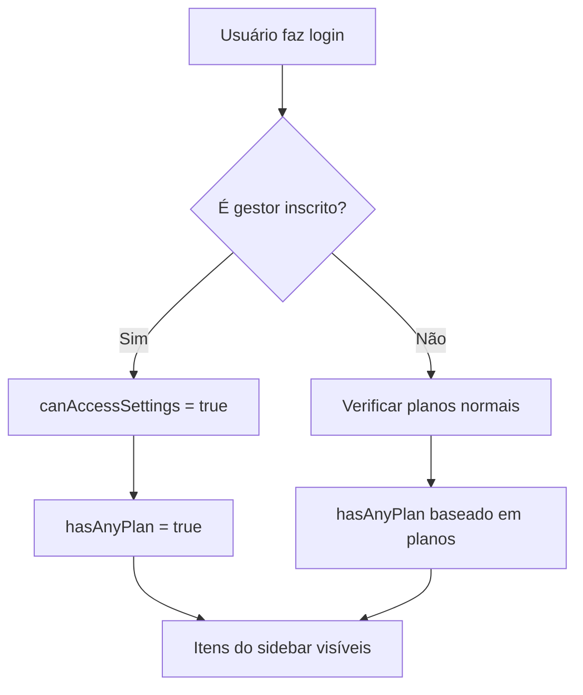

# Correção de Visibilidade para Gestores Inscritos

## 🚨 Problema Identificado

Os gestores inscritos não estavam vendo os seguintes itens no sidebar:
- ✅ **Agentes de IA** (`/chatbots`)
- ✅ **Meus Chips** (`/meus-chips`) 
- ✅ **Conexões** (`/conexoes`)

## 🔍 Causa Raiz

O problema estava nas **condições de exibição** do sidebar que não consideravam adequadamente os gestores inscritos:

### **1. Condição `hasAnyPlan` Insuficiente**
```typescript
// ANTES - Não incluía gestores
const hasAnyPlan = isTrial || plano_agentes || plano_crm || plano_starter || plano_plus || plano_pro;
```

### **2. Condições Específicas Restritivas**
```typescript
// ANTES - Agentes de IA
<NavItem to="/chatbots" icon={Bot} label="Agentes de IA" disabled={isPlansPage && !hasAnyPlan} />

// ANTES - Meus Chips  
<NavItem to="/meus-chips" icon={CreditCard} label="Meus Chips" 
  show={isTrial || (!plano_agentes && canAccessMeusChips)} 
  disabled={isPlansPage && !hasAnyPlan} />

// ANTES - Conexões
<NavItem to="/conexoes" icon={Zap} label="Conexões" 
  disabled={isPlansPage && !hasAnyPlan} show={true} />
```

## ✅ Correções Implementadas

### **1. Atualização da Condição `hasAnyPlan`**
```typescript
// DEPOIS - Inclui gestores inscritos
const hasAnyPlan = isTrial || plano_agentes || plano_crm || plano_starter || plano_plus || plano_pro || canAccessSettings;
```

**Explicação**: Adicionado `|| canAccessSettings` para incluir gestores inscritos que têm `canAccessSettings = true`.

### **2. Simplificação das Condições de Exibição**

#### **Agentes de IA**
```typescript
// DEPOIS - Sempre visível (removido show restritivo)
<NavItem to="/chatbots" icon={Bot} label="Agentes de IA" disabled={isPlansPage && !hasAnyPlan} />
```

#### **Meus Chips**
```typescript
// DEPOIS - Visível para gestores e admins
<NavItem to="/meus-chips" icon={CreditCard} label="Meus Chips" 
  show={isTrial || canAccessMeusChips} 
  disabled={isPlansPage && !hasAnyPlan} />
```

**Mudança**: Removido `(!plano_agentes &&` para permitir acesso independente do plano.

#### **Conexões**
```typescript
// DEPOIS - Sempre visível (removido show restritivo)
<NavItem to="/conexoes" icon={Zap} label="Conexões" disabled={isPlansPage && !hasAnyPlan} />
```

## 🎯 Lógica de Permissões

### **Como Funciona Agora:**

1. **Gestores Inscritos** têm `canAccessSettings = true` e `canAccessMeusChips = true`
2. **`hasAnyPlan`** agora inclui gestores via `canAccessSettings`
3. **Itens do sidebar** são exibidos baseado em:
   - ✅ **Trial**: `isTrial = true`
   - ✅ **Planos**: `plano_agentes`, `plano_crm`, etc.
   - ✅ **Gestores**: `canAccessSettings = true`
   - ✅ **Permissões**: `canAccessMeusChips = true`

### **Fluxo de Verificação:**


## 🧪 Teste das Correções

### **Cenário de Teste:**
```json
{
  "id": 114,
  "name": "Financeiro EA",
  "email": "diego.almeida@basicobemfeito.com",
  "id_gestor": "29",
  "plano_pro": true
}
```

### **Resultado Esperado:**
- ✅ **Usuário ID "29"** deve ver todos os itens
- ✅ **Agentes de IA** - Visível
- ✅ **Meus Chips** - Visível  
- ✅ **Conexões** - Visível
- ✅ **Configurações** - Visível
- ✅ **Departamentos** - Visível

### **Verificação no Console:**
```typescript
// Verificar permissões do gestor
const { canAccessSettings, canAccessMeusChips, userType } = useUserType();
console.log('Tipo:', userType); // Deve ser "Gestor"
console.log('Pode acessar configurações:', canAccessSettings); // Deve ser true
console.log('Pode acessar meus chips:', canAccessMeusChips); // Deve ser true
```

## 🔧 Troubleshooting

### **Problema: Gestor ainda não vê os itens**
**Solução:**
```typescript
// Verificar se o gestor está sendo detectado corretamente
const { userType, canAccessSettings } = useUserType();
console.log('UserType:', userType);
console.log('CanAccessSettings:', canAccessSettings);
```

### **Problema: Itens aparecem mas estão desabilitados**
**Solução:**
```typescript
// Verificar hasAnyPlan
const hasAnyPlan = isTrial || plano_agentes || plano_crm || plano_starter || plano_plus || plano_pro || canAccessSettings;
console.log('HasAnyPlan:', hasAnyPlan);
```

### **Problema: Permissões não são detectadas**
**Solução:**
```sql
-- Verificar se o gestor está no campo id_gestor
SELECT id, name, id_gestor FROM clientes_info WHERE id = 114;
```

## 📊 Status das Correções

- ✅ **hasAnyPlan atualizado** - Inclui gestores inscritos
- ✅ **Agentes de IA** - Sempre visível
- ✅ **Meus Chips** - Visível para gestores
- ✅ **Conexões** - Sempre visível
- ✅ **Condições simplificadas** - Menos restritivas
- ✅ **Compatibilidade mantida** - Não afeta outros usuários

## 🎉 Resultado Final

**Gestores inscritos agora têm acesso completo a:**
- ✅ **Agentes de IA** (`/chatbots`)
- ✅ **Meus Chips** (`/meus-chips`)
- ✅ **Conexões** (`/conexoes`)
- ✅ **Configurações** (`/settings`)
- ✅ **Departamentos** (`/departamentos`)
- ✅ **Todas as outras funcionalidades**

---

**Problema resolvido!** 🎉

Os gestores inscritos agora têm visibilidade completa de todas as funcionalidades do cliente.


