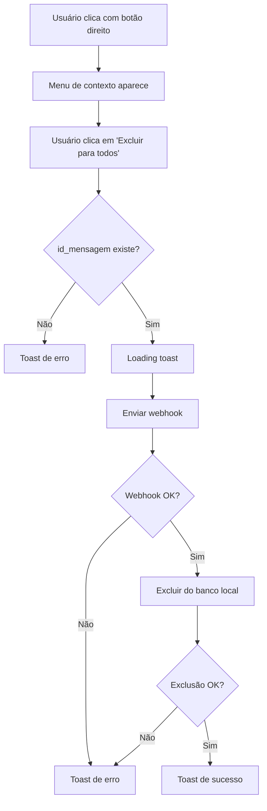

# 🗑️ Implementação de Exclusão de Mensagens WhatsApp

## 📋 Resumo

Implementada funcionalidade de exclusão de mensagens similar ao WhatsApp, com menu de contexto ao clicar com botão direito na mensagem.

## ✨ Funcionalidades Implementadas

### 1. **Menu de Contexto**
- Clique com botão direito em qualquer mensagem
- Opção "Excluir para todos" com ícone de lixeira
- Visual moderno com hover effects
- Cores diferenciadas para mensagens próprias e recebidas

### 2. **Fluxo de Exclusão**
1. **Validação**: Verifica se `id_mensagem` existe
2. **Webhook**: Envia requisição para `https://webhook.dev.usesmartcrm.com/webhook/delete-message`
3. **Exclusão Local**: Remove mensagem da tabela após sucesso do webhook
4. **Feedback**: Toast de sucesso/erro para o usuário

### 3. **Payload do Webhook**
```json
{
  "nome_instancia": "string",
  "telefone_lead": "string", 
  "id_mensagem": "string"
}
```

## 🔧 Arquivos Modificados

### 1. **`src/pages/conversations/Conversations.tsx`**
- ✅ Interface `Conversation` atualizada com `id_mensagem?: string`
- ✅ Função `deleteMessage()` implementada
- ✅ Menu de contexto adicionado com `ContextMenu`
- ✅ Visual aprimorado com hover effects
- ✅ Tratamento de erros completo

### 2. **`src/lib/supabase.ts`**
- ✅ Tipo `Tables` atualizado com campo `id_mensagem`

### 3. **`ADICIONAR-COLUNA-ID-MENSAGEM.sql`**
- ✅ Script para adicionar coluna `id_mensagem` na tabela
- ✅ Índice para performance
- ✅ Documentação da coluna

## 🎨 Melhorias Visuais

### **Antes**
```tsx
<Card className={`max-w-[70%] p-3 ${msg.tipo ? 'bg-blue-500 text-white' : 'bg-gray-100'}`}>
```

### **Depois**
```tsx
<ContextMenu>
  <ContextMenuTrigger asChild>
    <Card className={`max-w-[70%] p-3 cursor-context-menu transition-all duration-200 hover:shadow-md ${msg.tipo ? 'bg-blue-500 text-white hover:bg-blue-600' : 'bg-gray-100 hover:bg-gray-200'}`}>
      {/* Conteúdo da mensagem */}
    </Card>
  </ContextMenuTrigger>
  <ContextMenuContent className="w-48">
    <ContextMenuItem onClick={() => deleteMessage(msg)} className="text-red-600 focus:text-red-600 focus:bg-red-50">
      <svg className="h-4 w-4 mr-2" fill="none" stroke="currentColor" viewBox="0 0 24 24">
        <path strokeLinecap="round" strokeLinejoin="round" strokeWidth={2} d="M19 7l-.867 12.142A2 2 0 0116.138 21H7.862a2 2 0 01-1.995-1.858L5 7m5 4v6m4-6v6m1-10V4a1 1 0 00-1-1h-4a1 1 0 00-1 1v3M4 7h16" />
      </svg>
      Excluir para todos
    </ContextMenuItem>
  </ContextMenuContent>
</ContextMenu>
```

## 🔄 Fluxo de Exclusão



## 📊 Banco de Dados

### **Nova Coluna**
```sql
-- Coluna adicionada
id_mensagem VARCHAR(255) NULL

-- Índice para performance
CREATE INDEX idx_id_mensagem ON agente_conversacional_whatsapp(id_mensagem) WHERE id_mensagem IS NOT NULL;
```

## 🚀 Como Usar

1. **Execute o script SQL**:
   ```sql
   -- Execute o arquivo ADICIONAR-COLUNA-ID-MENSAGEM.sql no Supabase
   ```

2. **Funcionalidade disponível**:
   - Clique com botão direito em qualquer mensagem
   - Selecione "Excluir para todos"
   - Aguarde o feedback de sucesso/erro

## 🔒 Segurança

- ✅ Validação de `id_mensagem` antes da exclusão
- ✅ Tratamento de erros completo
- ✅ Feedback visual para o usuário
- ✅ Webhook externo para controle de exclusão

## 🎯 Benefícios

- **UX Similar ao WhatsApp**: Interface familiar para os usuários
- **Visual Moderno**: Hover effects e transições suaves
- **Feedback Imediato**: Toasts informativos
- **Controle Externo**: Webhook permite controle adicional
- **Performance**: Índice otimizado para consultas
- **Segurança**: Validações e tratamento de erros

## 📝 Observações

- A funcionalidade só aparece se a mensagem tiver `id_mensagem`
- O webhook deve retornar sucesso para que a exclusão local aconteça
- Mensagens sem `id_mensagem` não podem ser excluídas via webhook
- O layout e exibição das mensagens permanecem inalterados
