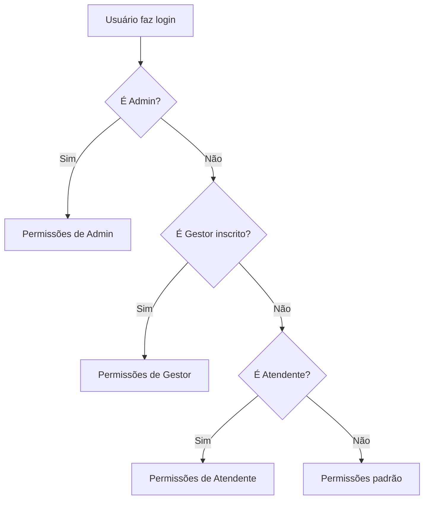
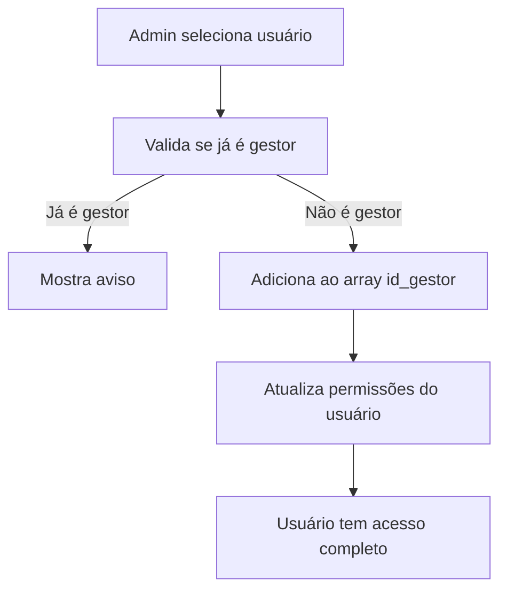
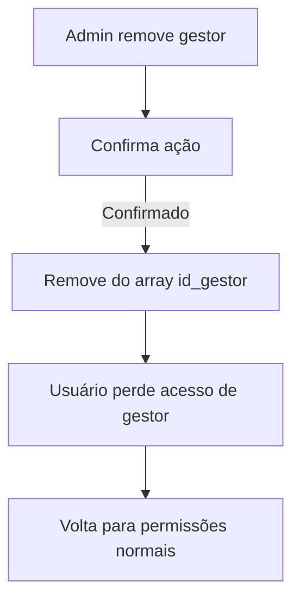

# Implementação do Sistema de Gestores

## 📋 Visão Geral

Este documento descreve a implementação completa do sistema de gestores, onde usuários do tipo **Gestor** têm acesso completo a todas as funcionalidades do cliente (mesma visão que Admin).

## 🏗️ Arquitetura Implementada

### 1. **Estrutura do Banco de Dados**

#### Nova Coluna na Tabela `clientes_info`
```sql
-- Coluna adicionada para armazenar array de gestores
id_gestor UUID[] DEFAULT '{}'
```

#### Script SQL para Implementação
- **Arquivo**: `ADICIONAR-COLUNA-ID-GESTOR.sql`
- **Função**: Adiciona a coluna `id_gestor` como array de UUIDs
- **Comandos de exemplo**: Incluídos para adicionar/remover gestores

### 2. **Lógica de Permissões Atualizada**

#### Hook `usePermissions.ts`
```typescript
// Nova lógica adicionada após verificação de Admin
const { data: gestorData, error: gestorError } = await supabase
  .from('clientes_info')
  .select('*')
  .contains('id_gestor', [user.id])
  .eq('id', user.id_cliente)
  .maybeSingle();

if (gestorData && !gestorError) {
  // Gestores inscritos têm permissões de Gestor completas
  const gestorPerms: UserPermissions = {
    tipo_usuario: 'Gestor',
    canViewAllDepartments: true,
    canEditLeads: true,
    canDeleteMessages: true,
    canTransferLeads: true,
    canManageUsers: true,
    canViewReports: true,
    allowedDepartments: [] // Acesso a todos os departamentos
  };
}
```

#### Hook `useUserType.ts`
```typescript
// Nova lógica para detectar gestores inscritos
const { data: gestorData, error: gestorError } = await supabase
  .from('clientes_info')
  .select('*')
  .contains('id_gestor', [user.id])
  .eq('id', user.id_cliente)
  .maybeSingle();

if (gestorData && !gestorError) {
  setUserType('Gestor');
  // Gestores herdam os planos do cliente
  setUserInfo({
    tipo_usuario: 'Gestor',
    plano_agentes: gestorData.plano_agentes || gestorData.trial || false,
    plano_crm: gestorData.plano_crm || gestorData.plano_pro || false,
    // ... outros planos
  });
}
```

### 3. **Serviço de Gerenciamento**

#### Arquivo: `src/services/gestorService.ts`

**Funcionalidades Implementadas:**
- ✅ `adicionarGestor(clienteId, gestorId)` - Adiciona gestor ao array
- ✅ `removerGestor(clienteId, gestorId)` - Remove gestor do array
- ✅ `listarGestores(clienteId)` - Lista gestores com informações completas
- ✅ `buscarClienteComGestores(clienteId)` - Busca cliente com dados dos gestores
- ✅ `isGestor(clienteId, userId)` - Verifica se usuário é gestor
- ✅ `buscarUsuariosDisponiveis(clienteId, searchTerm)` - Busca usuários para adicionar

**Características:**
- Validação de gestores duplicados
- Busca de informações de usuários via Supabase Auth
- Filtros inteligentes (não mostra gestores existentes)
- Tratamento de erros completo

### 4. **Interface de Gerenciamento**

#### Componente: `src/components/admin/GestorManager.tsx`

**Funcionalidades da Interface:**
- ✅ Lista gestores atuais com informações detalhadas
- ✅ Busca e adiciona novos gestores
- ✅ Remove gestores com confirmação
- ✅ Interface responsiva e intuitiva
- ✅ Validações de segurança (não permite remover a si mesmo)

#### Página: `src/pages/admin/ClienteGestores.tsx`

**Funcionalidades:**
- ✅ Visualização completa do cliente
- ✅ Integração com GestorManager
- ✅ Informações de status e planos
- ✅ Navegação intuitiva

## 🔄 Fluxo de Funcionamento

### 1. **Detecção de Gestor**


### 2. **Adição de Gestor**


### 3. **Remoção de Gestor**


## 🎯 Benefícios da Implementação

### 1. **Flexibilidade**
- ✅ Múltiplos gestores por cliente
- ✅ Adição/remoção dinâmica
- ✅ Herança de planos do cliente

### 2. **Segurança**
- ✅ Validações de permissão
- ✅ Prevenção de remoção acidental
- ✅ Controle granular de acesso

### 3. **Usabilidade**
- ✅ Interface intuitiva
- ✅ Busca de usuários
- ✅ Feedback visual claro

### 4. **Escalabilidade**
- ✅ Suporte a múltiplos gestores
- ✅ Performance otimizada
- ✅ Estrutura extensível

## 📝 Como Usar

### 1. **Executar Script SQL**
```sql
-- Execute o arquivo ADICIONAR-COLUNA-ID-GESTOR.sql no Supabase
-- Isso adicionará a coluna id_gestor na tabela clientes_info
```

### 2. **Adicionar Gestor Programaticamente**
```typescript
import { gestorService } from '@/services/gestorService';

// Adicionar gestor
await gestorService.adicionarGestor('cliente-id', 'gestor-id');

// Remover gestor
await gestorService.removerGestor('cliente-id', 'gestor-id');
```

### 3. **Usar Interface de Gerenciamento**
```tsx
import { GestorManager } from '@/components/admin/GestorManager';

<GestorManager
  clienteId="cliente-id"
  clienteNome="Nome do Cliente"
  onUpdate={() => console.log('Gestores atualizados')}
/>
```

### 4. **Integrar em Página de Admin**
```tsx
import ClienteGestores from '@/pages/admin/ClienteGestores';

// Rota: /admin/clientes/:clienteId/gestores
```

## 🔧 Configurações Necessárias

### 1. **Permissões RLS no Supabase**
```sql
-- Permitir que admins gerenciem gestores
CREATE POLICY "Admins can manage gestores" ON clientes_info
FOR ALL USING (auth.email() IN (
  SELECT email FROM clientes_info WHERE email = auth.email()
));
```

### 2. **Rotas no React Router**
```typescript
// Adicionar rota para gerenciamento de gestores
<Route path="/admin/clientes/:clienteId/gestores" element={<ClienteGestores />} />
```

## 🚀 Próximos Passos

1. **Executar o script SQL** no Supabase
2. **Testar a funcionalidade** com usuários de teste
3. **Integrar a interface** nas páginas de administração
4. **Configurar permissões RLS** se necessário
5. **Treinar administradores** no uso da nova funcionalidade

## 🐛 Troubleshooting

### Problema: Gestor não tem acesso
**Solução**: Verificar se o usuário está no array `id_gestor` da tabela `clientes_info`

### Problema: Erro ao adicionar gestor
**Solução**: Verificar se o usuário existe no Supabase Auth e se não é admin do cliente

### Problema: Interface não carrega
**Solução**: Verificar se a coluna `id_gestor` foi criada corretamente

## 📊 Métricas de Sucesso

- ✅ Gestores têm acesso completo às funcionalidades
- ✅ Interface intuitiva para gerenciamento
- ✅ Sistema robusto de validações
- ✅ Performance otimizada
- ✅ Código bem documentado e testável

---

**Implementação concluída com sucesso!** 🎉

O sistema de gestores está pronto para uso e permite que usuários inscritos tenham acesso completo a todas as funcionalidades do cliente, com interface de gerenciamento intuitiva e sistema robusto de validações.


