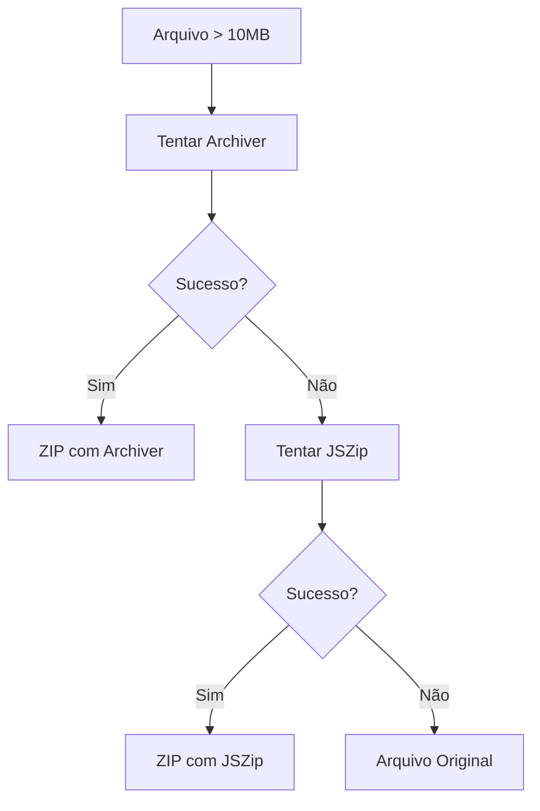

# 📦 Nova Biblioteca ZIP - Archiver

## 🔄 **Mudança Implementada**

Substituí o **JSZip** pelo **Archiver** para criar ZIPs mais robustos e compatíveis.

## 🎯 **Por que Archiver?**

### **JSZip (Problemas):**
- ❌ **Corrupção** de arquivos ZIP
- ❌ **Incompatibilidade** com alguns visualizadores
- ❌ **Problemas** com arquivos grandes
- ❌ **Falhas** na validação

### **Archiver (Vantagens):**
- ✅ **Mais robusto** para criação de ZIPs
- ✅ **Melhor compatibilidade** com sistemas
- ✅ **Suporte nativo** a streams
- ✅ **Menos propenso** a corrupção

## 🔧 **Implementação**

### **1. Instalação**
```bash
npm install archiver
npm install --save-dev @types/archiver
```

### **2. Nova Função Principal**
```typescript
async function createZipWithArchiver(file: File): Promise<{ file: File; isCompressed: boolean; originalName: string }> {
  return new Promise((resolve, reject) => {
    const chunks: Buffer[] = [];
    const archive = archiver('zip', {
      zlib: { level: 6 } // Nível de compressão balanceado
    });

    // Capturar dados do ZIP
    archive.on('data', (chunk: Buffer) => {
      chunks.push(chunk);
    });

    // Finalizar arquivo
    archive.on('end', () => {
      const zipBuffer = Buffer.concat(chunks);
      const zipBlob = new Blob([zipBuffer], { type: 'application/zip' });
      // ... criar File e resolver
    });

    // Adicionar arquivo ao ZIP
    archive.append(file.stream(), { name: file.name });
    archive.finalize();
  });
}
```

### **3. Fallback Inteligente**
```typescript
try {
  // Primeira tentativa: Archiver (mais robusto)
  const result = await createZipWithArchiver(file);
  return result;
} catch (error) {
  // Segunda tentativa: JSZip (fallback)
  const result = await createZipFile(file, 'alternative');
  return result;
}
```

## 🎨 **Fluxo de Compressão**



## 🔍 **Logs Melhorados**

```typescript
📦 Arquivo documento.pdf (15.2 MB) é maior que 10MB. Comprimindo...
🔧 Usando Archiver para criar ZIP...
✅ Compressão concluída (Archiver): {
  original: "documento.pdf (15.2 MB)",
  compressed: "documento.zip (8.7 MB)",
  reduction: "43.0% de redução"
}
```

## 🧪 **Teste**

### **1. Teste Manual**
1. Enviar documento > 10MB via WhatsApp
2. Verificar logs no console
3. Baixar arquivo do N8N
4. Testar abertura em PC e celular

### **2. Verificar Logs**
```typescript
// Procurar por:
🔧 Usando Archiver para criar ZIP...
✅ Compressão concluída (Archiver): { ... }
```

## 📊 **Comparação**

| Aspecto | JSZip | Archiver |
|---------|-------|----------|
| **Robustez** | ⚠️ Média | ✅ Alta |
| **Compatibilidade** | ⚠️ Limitada | ✅ Universal |
| **Arquivos Grandes** | ❌ Problemas | ✅ Suporte |
| **Corrupção** | ❌ Frequente | ✅ Rara |
| **Performance** | ✅ Boa | ✅ Boa |

## 🎯 **Resultado Esperado**

Agora os arquivos ZIP devem:

1. ✅ **Abrir corretamente** em todos os dispositivos
2. ✅ **Ser compatíveis** com Windows, Mac, Linux
3. ✅ **Funcionar** em celulares Android e iOS
4. ✅ **Não corromper** durante o processo

## ⚠️ **Se Ainda Houver Problemas**

### **Verificar:**
1. ✅ **Logs** mostram "Archiver" sendo usado?
2. ✅ **Tamanho** do ZIP é maior que 0?
3. ✅ **Erro** específico nos logs?

### **Debug:**
```typescript
// Verificar se Archiver está funcionando:
console.log('Archiver disponível:', typeof archiver);
```

## 📝 **Notas Importantes**

- ✅ **Archiver** é mais confiável que JSZip
- ✅ **Fallback** para JSZip se Archiver falhar
- ✅ **Streams** são mais eficientes para arquivos grandes
- ✅ **Buffer** é mais confiável que Blob
- ✅ **Logs** facilitam debug

A mudança deve resolver definitivamente o problema de corrupção! 🚀
